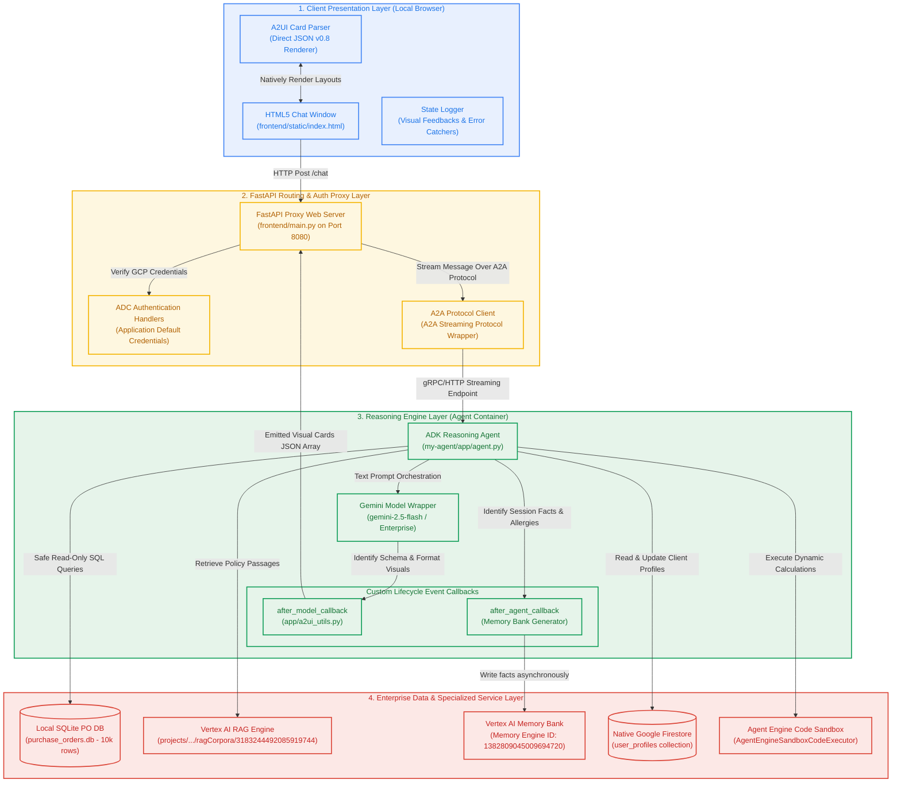
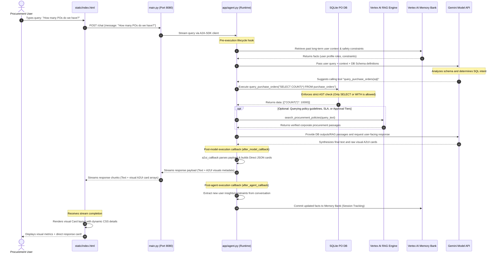

# Project Brief: Purchase Order Procurement & Compliance Analytics Agent

Welcome to the **Purchase Order (PO) Procurement & Compliance Analytics Agent** repository. This enterprise-grade AI system is designed for procurement teams, financial controllers, and procurement auditors to query purchase order data, audit compliance thresholds, analyze vendor risk, and search corporate procurement policies in real time.

---

## 🎯 System Capabilities

1. **Analytical Database Queries**: Directly translates natural language questions into secure, read-only SQL queries executed over a **10,000-row SQLite database (`purchase_orders.db`)** with built-in AST-based query safety guardrails (only SELECT/WITH statements are allowed).
2. **Policy RAG Grounding**: Powered by **Vertex AI Serverless RAG Engine** to search, retrieve, and ground agent decisions against official corporate procurement policies (e.g. approval thresholds, payment terms, vendor SLA guidelines).
3. **Compliance Auditing & Risk Scoring**: Includes specialized analytical action tools to calculate real-time vendor risk scores based on order volume and cancellation rates, and flag high-value or suspicious POs for human compliance reviews.
4. **Visual A2UI Cards**: Implements the **A2A protocol** and standard **A2UI Schema Manager (v0.8)** with a basic component catalog to return beautifully formatted structured visual layouts (cards, columns, and rows) directly in the chat window.
5. **Cross-Session Long-Term Memory**: Integrates a managed **Vertex AI Memory Bank** to dynamically remember, persist, and strictly enforce safety constraints (such as user-stated dietary or safety preferences) across separate user sessions.
6. **Firestore Profile Sync**: Connected to Google Cloud Native **Firestore** to manage user roles and procurement department profiles.

---

## 🏗️ Detailed System Architecture Diagram

The multi-tier system architecture below shows the separation of concerns between Client-side presentation, Proxy-side authentication, Reasoning Engine orchestration, and Google Cloud Platform services:



---

## 🔄 End-to-End System Workflow Diagram

The sequence diagram below shows the detailed step-by-step workflow of a single query lifecycle from the moment the user types a query (such as *"How many POs do we have?"*) to database translation, RAG lookup, layout generation, and memory storage:



---

## 📂 Repository Structure

The repository is structured logically across frontend services and backend reasoning engine components:

```
├── frontend/                        # Web chat interface and proxy
│   ├── main.py                      # FastAPI authentication proxy communicating over A2A
│   └── static/
│       └── index.html               # Plain HTML UI containing native A2UI visual card renderer
├── my-agent/                        # Deployed ADK Reasoning Engine Agent
│   ├── app/
│   │   ├── agent.py                 # Core agent declaration, system prompts, and tool registrations
│   │   ├── a2ui_utils.py            # A2UI Direct JSON formatter after_model_callback
│   │   ├── db.py                    # SQLite database safety guardrails & connection manager
│   │   ├── tools.py                 # Procurement tools (Vendor Risk, Flag Audit, CSV Export)
│   │   ├── rag_tool.py              # Vertex AI RAG policy retrieval tool
│   │   ├── rag_config.txt           # Active RAG Corpus ID configuration
│   │   └── firestore_backend.py     # Firestore User Profiles database operations
│   ├── purchase_orders.db           # 10,000 row SQLite database file packaged with container
│   ├── pyproject.toml               # Python packaging metadata and dependencies (google-adk, etc.)
│   └── agents-cli-manifest.yaml     # reasoningEngine deployment manifest
└── project_brief.md                 # System overview, capabilities, and Mermaid diagram (this file)
```
